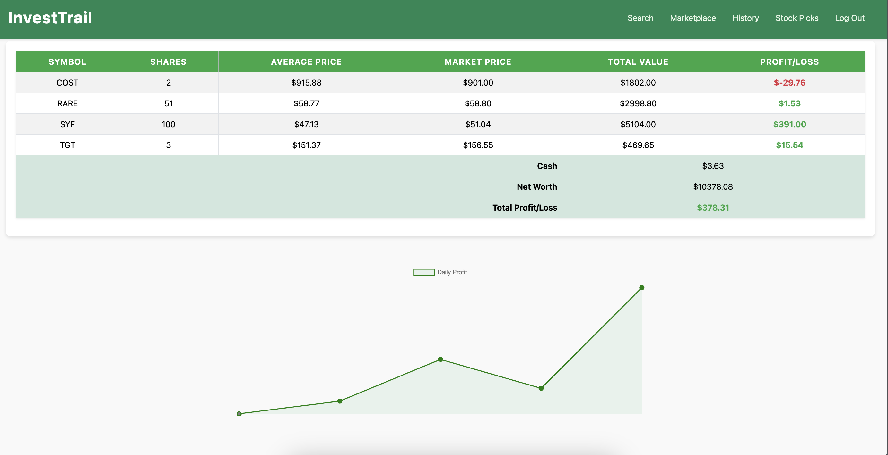

# InvestTrail
### Video Demo: https://youtu.be/-DQ9-I1psHw
### Description:


#### Stock Trading Simulator

A Flask-based stock trading simulator where users can search for stocks, manage their portfolios, and get AI-generated stock recommendations. The application integrates real-time stock data, user authentication, and transaction management.

###### Features
User Authentication: Register and log in securely to manage your stock portfolio.
Stock Search: Look up real-time stock prices and details using valid stock symbols.
Buy and Sell Stocks: Manage your portfolio by buying or selling stocks with real-time data.
Transaction History: Track your past transactions for better financial decision-making.
AI Recommendations: Receive personalized stock recommendations based on your preferences, and current stock data provided by Yahoo Finance.

###### Setup and Installation
Requirements,
Python 3.x,
Flask,
SQLite,
yFinance,
Groq API (for AI stock recommendations),
Other dependencies listed in requirements.txt

###### Installation
- APIs **IMPORTANT
- Create an account with groq, and generate an api key, in your CLI
- Use a random generator online to create a unique secret key, can be anything.


Setting up API key for Groq AI and SECRET key for Flask-WTF
```
echo $SHELL # to know your shell, for example /bin/bash
export GROQ_API_KEY="YOUR API KEY" >> ~/.bashrc
export SECRET_KEY="YOUR SECRET KEY" >> ~/.bashrc
source ~/.bashrc # to export key into environment permanently for future uses
```


bash
Clone the repository
```
git clone <repo_url>
cd final_project
```

Install dependencies
```
pip install -r requirements.txt
```

Set up the SQLite database by running the migration script:
```
flask db upgrade
```


Start the Flask server
```
flask run
```

###### Usage:
Once the server is running, visit the application in your browser and follow these steps:

Register an Account: Sign up using a valid email and password.
Log In: Access your portfolio and start trading.
Search for Stocks: Enter a valid stock symbol to view its real-time price and details.
Buy or Sell Stocks: Enter the number of shares you wish to trade (up to 100 shares per transaction).
AI Recommendations: Get personalized stock recommendations based on your preferences.

###### Routes
/ (Homepage)
The homepage displays a summary of your current portfolio, including stocks you own and your available cash balance. The page provides quick access to search for stock symbols and manage your portfolio.

/register
The registration page allows new users to sign up. Users must provide a valid email and a secure password. The password will be hashed and stored securely.

/login
The login page enables users to sign in using their registered email and password. Successful login grants access to the user's portfolio and trading functions.

/logout
Logs the user out and clears the session.

/transactions
This route handles stock transactions. Users can:

Search Stock Information: Enter a stock symbol to retrieve real-time stock information.
Buy Stocks: Purchase up to 100 shares of any valid stock, provided the user has enough cash.
Sell Stocks: Sell up to 100 shares, provided the user owns that many shares.
It includes safeguards for ensuring valid inputs and prevents race conditions by using user-specific locks to handle concurrent transactions.

/ai
This route provides AI-generated stock recommendations based on user preferences. The user can specify:

Industry
Risk level
Expected returns
Dividend preferences
Using the Groq API, and data from Yahoo Finance in the back end, the app returns a list of stock recommendations in JSON format, with detailed reasons for each suggestion.

###### Database Schema
Users Table

    id (INTEGER, Primary Key, Auto-increment, Not Null): Unique identifier for each user.
    username (TEXT, Not Null): Username for login.
    hash (TEXT, Not Null): Encrypted password hash.
    cash (NUMERIC(10, 2), Not Null, Default 10000.00): Amount of cash the user has, with 2 decimal places.
    failed_attempts (INTEGER, Default 0): Number of failed login attempts.
    last_failed_attempt (TIMESTAMP): Timestamp of the last failed login attempt.


Transactions Table

    id (INTEGER, Primary Key, Auto-increment): Unique identifier for each transaction.
    user_id (INTEGER, Not Null, Foreign Key): Reference to the users table.
    symbol (TEXT, Not Null): Stock symbol (e.g., AAPL).
    shares (NUMERIC(10, 1), Not Null): Number of shares bought or sold, with 1 decimal place.
    price (NUMERIC(10, 2), Not Null): Price per share at the time of the transaction, with 2 decimal places.
    timestamp (DATETIME, Default CURRENT_TIMESTAMP): Date and time of the transaction.
    transaction_type (TEXT, Not Null): Type of transaction (buy/sell).
    anchor (TEXT): Optional field for additional data related to the transaction.

User_Stocks Table

    id (INTEGER, Primary Key, Auto-increment): Unique identifier for each user stock record.
    user_id (INTEGER, Not Null, Foreign Key): Reference to the users table.
    symbol (TEXT, Not Null): Stock symbol.
    average_price (NUMERIC(10, 2), Not Null): Average price at which the user bought the stock, with 2 decimal places.
    total_shares (NUMERIC(10, 1), Not Null): Total number of shares the user owns, with 1 decimal place.
    Unique Key (user_id, symbol): Ensures a user can only have one record per stock symbol.


Daily_Profits Table

    id (INTEGER, Primary Key, Auto-increment): Unique identifier for each profit record.
    user_id (INTEGER, Not Null, Foreign Key): Reference to the users table.
    date (DATE, Not Null): Date for the profit record.
    profit (NUMERIC(10, 2), Not Null): Total profit for the day, with 2 decimal places.
    Unique Key (user_id, date): Ensures a user can only have one profit record per day.


###### Logging
The application includes detailed logging to help monitor transactions, track user actions, and debug AI responses. Logs are stored in a file for auditing and debugging purposes.


## Security Features
- The biggest concerns when it comes to any websites is the security features that it offers, when signing up for an account, users will want to feel safe creating one and that the information won't be exploited even if database is stolen, here are some key security features in my projects. All features are implemented both in the back-end and front-end for more robust protection

1. Logging and monitoring prints for easier debug and information
2. For protection against Password attacks, I implemented:
    - Strong password complexity to the standard of NIST(National Institution of Standards and Technology) currently.
    - Hashing user' passwords in database
    - Lock out after 5 failed attempts to prevent brute force
    - Use of Flask-WTF to prevent CSRF, Flask-WTF generate unique token for each user's session, and using forms.py file to validate user's password in the back-end
3. For input validation and injection attacks:
    - All data when received from the front end are sanitized and validated to ensure no malicious data is being used. Combinations of regex and length check are implemented, such as only allowing max 6 characters for stock symbols, max value for shares to avoid input of massive floating point value
    - All SQL statements are used in conjunction with placeholders for usuability and easy validations before passing into the database
4. Session uses filesystem (instead of signed cookies), session is also cleared when user log out or login multiple times
5. Rate limiter are implemented, to prevent DoS attack, user is only allow to use recommendations 5 times per 5 min
6. User input is escaped properly to prevent CSS (Cross Site Scripting) attack
7. Implemented Lock from threading to prevent race condition attack where user try to send multiple buy and sell requests at the same time.
8. API key and Secret key are not hardcoded and are exported into the environment


## Project folder

### app.py
- The core component of the project, this Python file contains all the Flask routes and associated functionalities for handling user interactions, such as displaying pages, processing forms, and managing transactions. It also includes the main logic for user authentication, stock transactions, and ai recommendations.

### helpers.py
- This file includes utility functions and helper methods used throughout the application. These functions assist with essential tasks such as ensure user is logged in with decorated function, updating the database, performing stock lookups, and handling various application-specific operations.

### forms.py
- This file defines the forms used in the application, including user login and registration. It manages form validation and provides the structure for user input in different parts of the application, goes hand in hand with the /login and /register routes to prevent CSRF attack.

### database and static folder
- Holds static assets like CSS files, JavaScript files, images, and other resources that are served directly to the client. This folder is essential for the front-end appearance and functionality of the application.
- Database: SQLite Database, use with cs50 library for easier implementation and preventation against injection attack

### templates folder
- Contains HTML template files used by Flask’s rendering engine. These templates define the layout and structure of the web pages, including views for the main interface, user interactions, and dynamic content rendering.


## Screenshots:
- Here are some screen shots of AI generated recommendations, keep in mind these recommendations are made in the past so market data could be different at the moment, but here are some well performing stock

### recommendation1 screenshot


### recommendations2 screenshot


### portfolio screenshot


### portfolio screenshot 2


### portfolio screenshot 3


